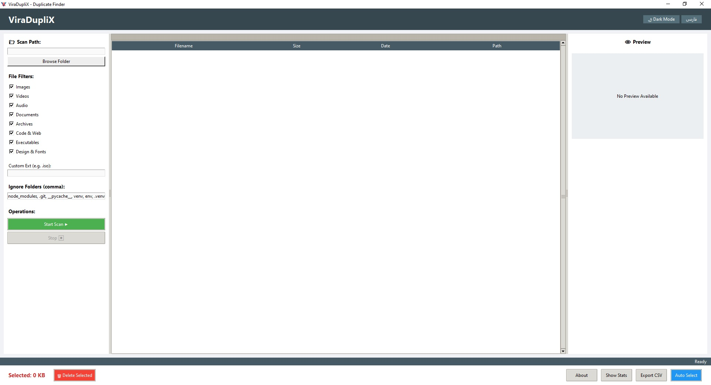
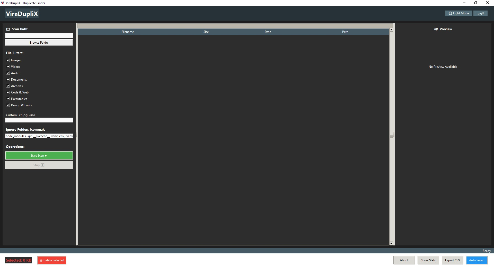
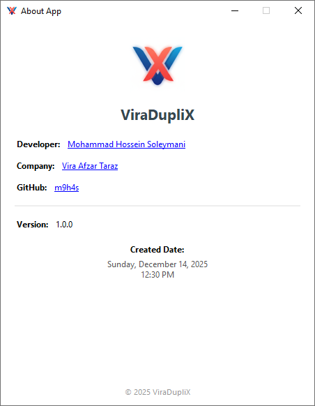

# 🧹 ViraDupliX
A modern Python GUI tool for detecting and managing duplicate files with smart hashing, preview, and safe deletion.

<p align="center">
  
</p>

---

## 🇮🇷 معرفی | Introduction (FA)

**ViraDupliX** یک ابزار گرافیکی قدرتمند و حرفه‌ای برای شناسایی و مدیریت فایل‌های تکراری (Duplicate Files) در سیستم‌عامل‌های دسکتاپ است که با **Python و Tkinter** توسعه داده شده است.

این برنامه به شما کمک می‌کند فایل‌های تکراری را به‌صورت ایمن شناسایی، بررسی و حذف کنید و فضای دیسک خود را آزاد نمایید.

---

## 🇬🇧 Introduction | معرفی (EN)

**ViraDupliX** is a powerful and professional graphical tool for detecting and managing duplicate files on desktop operating systems, developed using **Python and Tkinter**.

It helps you safely identify, review, and remove duplicate files to free up disk space.

---

## ✨ ویژگی‌ها | Features

### 🇮🇷 فارسی

- 🔍 اسکن هوشمند فایل‌های تکراری بر اساس:
  - حجم فایل
  - هش اولیه (Partial Hash)
  - هش کامل (MD5)
- 🎨 رابط کاربری گرافیکی مدرن و کاربرپسند
- 🌙 حالت شب / ☀️ حالت روز
- 🌐 پشتیبانی دو زبانه (فارسی / English)
- 🖱️ پشتیبانی از Drag & Drop (در صورت نصب tkinterdnd2)
- 🗂️ فیلتر فایل‌ها بر اساس نوع (تصویر، ویدیو، صوت، اسناد و ...)
- 👁️ پیش‌نمایش تصاویر، ویدیوها و فایل‌های متنی
- 🧠 انتخاب خودکار فایل‌ها (نگه‌داشتن نسخه قدیمی‌تر)
- 🗑️ حذف امن فایل‌ها با Send2Trash
- 📊 نمایش میزان فضای قابل آزادسازی

### 🇬🇧 English

- 🔍 Smart duplicate file scanning based on:
  - File size
  - Partial hash
  - Full MD5 hash
- 🎨 Modern and user-friendly graphical interface
- 🌙 Dark mode / ☀️ Light mode
- 🌐 Bilingual support (Persian / English)
- 🖱️ Drag & Drop support (with tkinterdnd2 installed)
- 🗂️ File-type based filtering (images, videos, audio, documents, etc.)
- 👁️ Preview images, videos, and text files
- 🧠 Automatic file selection (keep the oldest version)
- 🗑️ Safe file deletion using Send2Trash
- 📊 Display of recoverable disk space

---

## 🖼️ پیش‌نمایش برنامه | Application Screenshots

<p align="center">
  
</p>

<p align="center">
  
</p>

<p align="center">
  
</p>

---

## 🛠️ پیش‌نیازها | Requirements

### 🇮🇷 فارسی

- Python نسخه **3.9+** (پیشنهادی)
- کتابخانه‌های موردنیاز:

```txt
numpy==2.2.6
opencv-python==4.12.0.88
pillow==12.0.0
Send2Trash==1.8.3
tkinterdnd2==0.4.3
```

نصب وابستگی‌ها:

```bash
pip install -r requirements.txt
```

### 🇬🇧 English

- Python **3.9+** (recommended)
- Required libraries:

```bash
pip install -r requirements.txt
```

---

## 🚀 نحوه اجرا | How to Run

### 🇮🇷 فارسی

```bash
python ViraDupliuX_App.py
```

### 🇬🇧 English

```bash
python ViraDupliuX_App.py
```

---

## 📂 ساختار پروژه | Project Structure

```text
.
├── logo.png
├── requirements.txt
├── ViraDupliuX_App.py
├── ScreenShot/
│   ├── dash_en.jpg
│   ├── dash_en_dark.jpg
│   └── about_en.png
```

---

## 🧠 منطق تشخیص فایل تکراری | Duplicate Detection Logic

### 🇮🇷 فارسی

1. پیمایش پوشه‌ها با `os.walk`
2. فیلتر فایل‌ها بر اساس پسوند
3. گروه‌بندی فایل‌ها بر اساس حجم
4. محاسبه هش اولیه (۴KB اول فایل)
5. محاسبه هش کامل (MD5)
6. نمایش گروه نهایی فایل‌های تکراری

### 🇬🇧 English

1. Directory traversal using `os.walk`
2. File filtering by extension
3. Grouping files by size
4. Calculating partial hash (first 4KB)
5. Calculating full MD5 hash
6. Displaying final duplicate file groups

---

## 🔐 ایمنی حذف فایل‌ها | Safe Deletion

### 🇮🇷 فارسی

- در صورت وجود Send2Trash، فایل‌ها به سطل بازیافت منتقل می‌شوند
- در غیر این صورت حذف دائمی انجام می‌شود

### 🇬🇧 English

- If Send2Trash is available, files are moved to the recycle bin
- Otherwise, files are permanently deleted

---

## 🌍 چندزبانه | Localization

### 🇮🇷 فارسی

- پشتیبانی کامل از زبان فارسی
- تغییر زبان تنها با یک کلیک

### 🇬🇧 English

- Full English language support
- One-click language switching

---

# 📌 درباره پروژه | About Project

---

## 🇮🇷 فارسی

- **نام برنامه:** ViraDupliX
- **نسخه:** 1.0.0
- **توسعه‌دهنده:** محمد حسین سلیمانی
- **شرکت:** ویرا افزار تاراز
- **سال توسعه:** 1404

---

## 🇬🇧 English

- **Application Name:** ViraDupliX
- **Version:** 1.0.0
- **Developer:** Mohammad Hossein Soleymani
- **Company:** Vira Afzar Taraz
- **Year:** 2025

---

## 🔗 Links

- 🌐 Developer Website: https://mhsoleymani.ir/
- 🏢 Company Website: https://codingtaraz.com/
- 💻 GitHub: https://github.com/m9h4s


---

## 📜 لایسنس | License

این پروژه تحت **MIT License** منتشر شده است.

✔️ استفاده، کپی، تغییر و انتشار با **ذکر منبع** مجاز است.

---

## 🤝 مشارکت | Contributing

### 🇮🇷 فارسی

Pull Request ها و پیشنهادات شما با آغوش باز پذیرفته می‌شوند.

### 🇬🇧 English

Pull requests, issues, and suggestions are welcome.

---

## ⭐ حمایت | Support

### 🇮🇷 فارسی

اگر این پروژه برای شما مفید بود:
- ⭐ به مخزن ستاره بدهید
- 🍴 Fork کنید
- 🗣️ به دیگران معرفی کنید

### 🇬🇧 English

If you find this project useful:
- ⭐ Star the repository
- 🍴 Fork it
- 🗣️ Share it with others

---

> © 2025 Mohammad Hossein Soleymani – Vira Afzar Taraz

**Built with ❤️ and Python**

